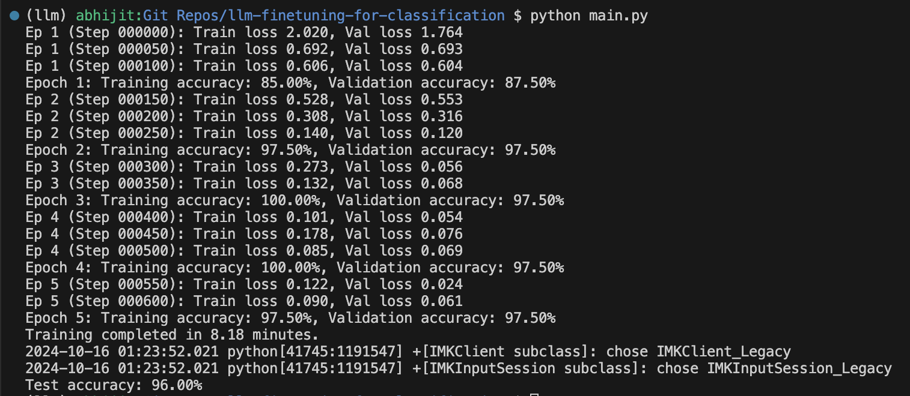
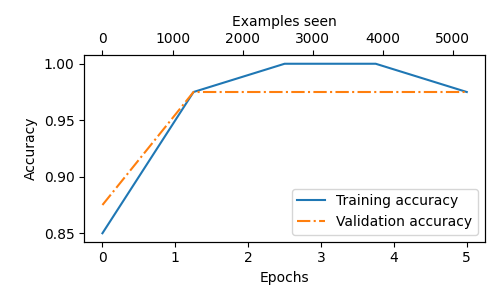

# 📩 SMS Spam Classification using GPT-2

Welcome to the **SMS Spam Classification** project! This project fine-tunes a pre-trained GPT-2 model to classify SMS messages as spam or ham (not spam). This repository is designed to make it easy to replicate the model, test it on your own datasets, and experiment with fine-tuning techniques. 🚀

## 📂 Directory Structure

Here's a quick overview of the project's structure:

#### Directory Structure

```plaintext
SMS Spam Classification
├── README.md                 # Project documentation
├── main.py                   # Main script for training, validation, testing
├── review_classifier.pth      # Trained model checkpoint
├── requirements.txt           # required packages
├── sms_spam_collection/       # Dataset folder
│   ├── SMSSpamCollection.tsv  # SMS spam dataset
│   └── readme                 # Dataset description
├── classifier/                # Spam prediction utilities
│   ├── predictor.py           # Functions to predict spam
│   └── spam_classifier.py     # Helper functions for classification
├── gpt2/                      # GPT-2 model files
│   └── 124M/                  # Pretrained GPT-2 model weights
│       ├── checkpoint         # Model checkpoint
│       ├── model.ckpt*        # Model weights
│       ├── encoder.json       # Tokenizer encoder
│       └── vocab.bpe          # Byte pair encoding vocabulary
├── nets/                      # Model architecture & configurations
│   ├── model_configs.py       # GPT model configurations
│   └── nets.py                # Defines GPT model architecture
├── resources/                 # Resources for results
│   ├── accuracy-plot.png      # Accuracy graph
│   └── loss-plot.png          # Loss graph
└── utils/                     # Utility scripts
    ├── data_preprocessing.py  # Data preprocessing functions
    ├── dataset.py             # Custom dataset class for SMS data
    └── utils.py               # Helper functions (loss, accuracy, evaluation)
```

## 📦 Installation
1. Clone the repository:
    ```bash
    git clone https://github.com/AbhijitMore/llm-finetuning-for-classification.git
    cd llm-finetuning-for-classification
    ```

2. Install the required Python packages:
    ```bash
    pip install -r requirements.txt
    ```

## 📊 Dataset
The [dataset](https://archive.ics.uci.edu/static/public/228/sms+spam+collection.zip) used is the **SMS Spam Collection** from UCI Machine Learning Repository.
It consists of two columns:
- `Label`: spam or ham
- `Text`: SMS message content

Store dataset as `sms_spam_collection/SMSSpamCollection.tsv` file.

## 🏃 Running the Project
1. **Training the Model**:
    Run the `main.py` script to start training the model:
    ```bash
    python main.py
    ```
    This will:
    - Load and preprocess the dataset.
    - Fine-tune GPT-2 for spam classification.
    - Train the model and output loss/accuracy graphs.

2. **Testing the Model**:
    After training, the model is automatically tested on the test dataset. Results are printed in the console.

3. **Visualizing Results**:
    Loss and accuracy graphs will be saved in the `resources/` folder as:
    - `accuracy-plot.png`
    - `loss-plot.png`

4. **Model Saving**:
    The trained model will be saved as `review_classifier.pth` in the root directory.

## 📈 Results

After training the model, the following console results were observed:

<p align="center">
  
</p>

The console output shows the progression of training and evaluation at various steps, providing real-time insights into loss and accuracy.

### Performance Graphs
<p align="center">
  
  
</p>

The accuracy and loss plots give a visual summary of model performance across epochs, indicating improvements and stability.

## Contributing
Contributions are welcome! 🎉 Whether you're reporting a bug, suggesting a new feature, or submitting a pull request, your input is valuable.
